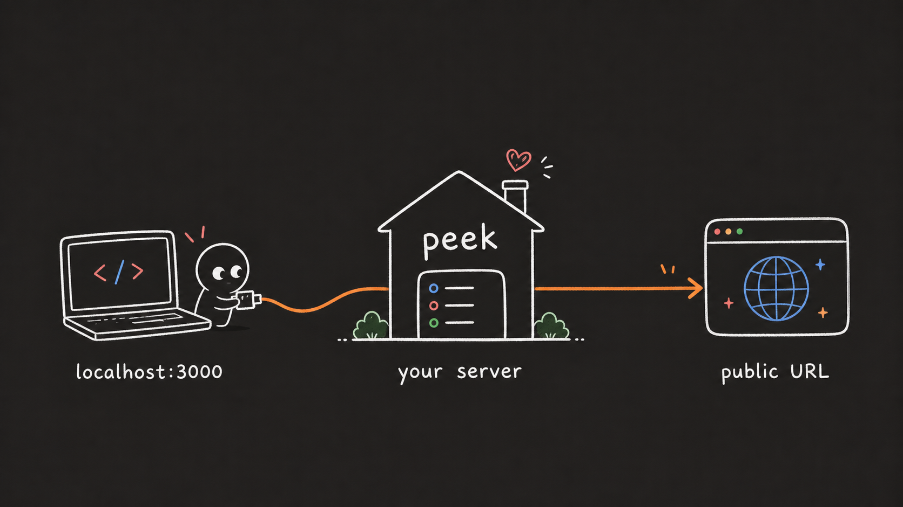

**Self-hosted public URLs for localhost.**

peek gives your local server a public URL through your own hosted proxy.

```text
localhost:3000 -> your peek server -> public URL
```

## Host

Container image:

```text
ghcr.io/sasicodes/peek:latest
```

```bash
docker run -p 8080:8080 \
  -e PEEK_DOMAIN=example.com \
  -e PEEK_AUTH_TOKEN=change-me \
  ghcr.io/sasicodes/peek:latest
```

`PEEK_AUTH_TOKEN` lets your CLI create tunnels on this server.

Add both custom domains to your host:

```text
example.com
*.example.com
```

Then add the DNS records your host gives you.

peek creates URLs like:

```text
https://{random}.example.com
```

`{random}` is 8 lowercase letters or numbers.

Serve peek behind HTTPS before exposing it publicly.

## Run

Install the CLI:

```bash
cargo install --git https://github.com/sasicodes/peek peek-client --force
```

Run peek with the same domain and token from your hosted server:

```bash
peek localhost:3000 --domain example.com --token change-me
```

Or export them once and run peek after that:

```bash
export PEEK_DOMAIN=example.com
export PEEK_AUTH_TOKEN=change-me
peek localhost:3000
```

peek prints a public URL.

### Options

| Option | Use |
| --- | --- |
| `--domain` | hosted peek domain, like `example.com` |
| `--token` | same value as `PEEK_AUTH_TOKEN` |
| `--subdomain` | public URL name, like `myapp` |
| `--password` | require a password for visitors |
| `--server` | full relay WebSocket URL, like `wss://example.com/tunnel` |

`--token` creates the tunnel. `--password` protects the public URL and is optional.

Without `--subdomain`, peek creates a random name. Without `--password`, the URL is public.

Environment variables:

```bash
PEEK_DOMAIN=example.com
PEEK_AUTH_TOKEN=change-me
PEEK_PASSWORD=optional-visitor-password
```

`PEEK_SERVER` can replace `PEEK_DOMAIN` when you need a full WebSocket URL. `PEEK_TOKEN` is still accepted as an old alias for `PEEK_AUTH_TOKEN`.

---

### Uninstall the CLI

```bash
cargo uninstall peek-client
```
